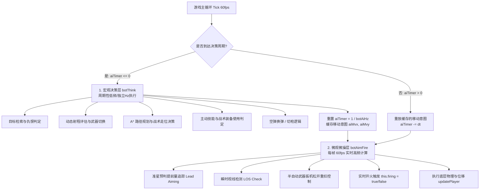
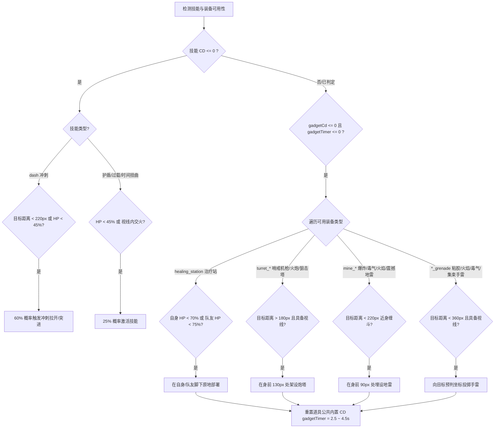

# 2D 俯视角多人射击游戏：人机对战 (Bot AI) 全量实现详解

> 本文档专注于该 2D 射击游戏**人机对战（Bot AI）系统的底层架构、感知系统、寻路导航、战斗决策、微操射击、团队协作及难度解耦机制**。不包含美术风格，提供可直接移植至其他项目的完整算法与工程实现规范。

---

## 一、 系统架构与双层解耦决策模型

游戏采用**宏观战略决策（Heavy Brain）与微观微操瞄准（Lightweight Micro）完全解耦的双层 AI 架构**，既保证了极高的计算性能，又彻底消除了 BOT 在面对突发目标时的“发呆”与反应迟钝问题。



### 1. 双层机制设计原则
1. **宏观决策层 (`botThink`)**：
   * 运行频率由 `botAiHz`（8Hz~60Hz）决定，计算间隔 $\Delta t_{\text{ai}} = \frac{1}{\text{botAiHz}}$。
   * 负责消耗性能的复杂运算：遍历搜索最优目标、评估主副武器 DPS-距离得分、执行 A* 离散网格寻路、部署战术道具（地雷/炮塔/手雷/治疗站）以及技能释放。
   * 输出移动意图分量（`aiMvx`, `aiMvy`）并缓存，供后续各帧重放。
2. **微观微操层 (`botAimFire`)**：
   * **每帧（60fps / requestAnimationFrame）强制运行**。
   * 即使宏观大脑处于决策休眠期，BOT 也会每帧实时根据目标的即时速度向量更新准星朝向、计算射击提前量，并检查视线阻挡。
   * 只要目标从掩体后露头，BOT 在当帧即可瞬间开火，完全杜绝了传统游戏 AI 因为决策周期过长导致的“从掩体出来后发呆 0.5 秒才开枪”的迟钝感。

---

## 二、 感知系统：目标检索与视线检测

### 1. 目标优先级与仇恨过滤
BOT 按照以下优先级链检索当前最优攻击目标：

```ts
// 目标筛选算法流程
let target: Player | null = null;
let bestD = Infinity;

// 1. 检索所有对局战斗实体 (PVP 玩家与其它 BOT)
for (const o of this.combatants) {
  if (o.id === c.id || this.isTeammate(c.id, o.id)) continue; // 排除自身与队友
  const q = o.player;
  if (q.deadTimer && q.deadTimer > 0) continue;              // 排除阵亡读秒中实体
  if (q.isCloaked) continue;                                 // 隐身技能生效中不可被锁定
  
  const d = (q.x - p.x) ** 2 + (q.y - p.y) ** 2;             // 欧氏距离平方
  if (d < bestD) { 
    bestD = d; 
    target = q; 
  }
}

// 2. 若未找到敌方玩家或处于生化模式 (Biohazard)，回退检索 PVE 怪物
if (!target || this.gameMode === "biohazard") {
  for (const e of this.enemies) {
    if (e.hp <= 0) continue;
    const d = (e.x - p.x) ** 2 + (e.y - p.y) ** 2;
    if (d < bestD) {
      bestD = d;
      target = { x: e.x, y: e.y, vx: e.vx ?? 0, vy: e.vy ?? 0, hp: e.hp, maxHp: e.maxHp, deadTimer: 0 };
    }
  }
}
```

### 2. 射线投射视线检测 (Raycasting Line-of-Sight - `botLOS`)
判断 BOT 与目标之间是否存在不可穿透的障碍物墙体，采用高效的 **Slab Method (Ray-AABB 求交)** 算法：

$$\text{Ray}(t) = \vec{O} + t \cdot \vec{D}, \quad t \in [0, \text{dist}]$$

* **算法流程**：
  1. 将起点 $(x_0, y_0)$ 到目标点 $(x_1, y_1)$ 计算为单位方向向量 $\vec{D} = (n_x, n_y)$ 及总距离 $\text{dist}$。
  2. 构造包围盒快速剪枝：若墙体处于线段 AABB 外围，直接跳过。
  3. 对潜在相交墙体执行二维 Slab 求交，计算最近碰撞距离 $t$。若 $0 \le t \le \text{dist}$，则判定视线被阻挡（LOS 为 `false`）。
* **微观 LOS 短暂缓存优化**：
  在每帧高频的 `botAimFire` 中，若上一帧检测的目标未变，使用 $0.1$ 秒的生存期（`losTtl = 0.1`）复用上一次射线求交结果，大幅降低全屏光线求交计算量。

---

## 三、 导航系统：A* 网格寻路与动态避障

### 1. 离散化 A* 网格寻路 (`findBotPath`)
当目标与 BOT 之间**无直线视线 (LOS Blocked)** 时，系统自动触发 A* 启发式网格寻路：

```
[全局世界地图 (如 3000×3000 px)]
               ↓
[离散化栅格 (CELL_SIZE = 60 px)]
               ↓
[节点可通行判定: 障碍物坐标点膨胀检测 (pSize + 10)]
               ↓
[8 方向邻居扩展 (直行代价 1.0, 对角线代价 1.414)]
               ↓
[曼哈顿/欧氏启发式 h(n) = hypot(dx, dy)]
               ↓
[回溯路径第 1 个路标格子 -> 输出移动方向向量 (dx, dy)]
```

* **安全膨胀机制**：在判定格子是否可通行时，不仅检测格子中心，还将 BOT 自身碰撞半径加上安全边距（`pSize + 10`），防止 BOT 紧贴墙角拐弯时发生物理擦碰卡死。
* **搜索步数截断**：设置单次搜索上限（`maxSteps = 250`），若超出步数仍未到达目标，自动平滑退化为朝当前已探索的最优最近节点（Min $f$-score）移动。
* **Web Worker 异步支持 (`src/game/ai.worker.ts`)**：
  提供独立的 Web Worker 寻路线程。前端主线程可发起 `postMessage({ type: "path", ... })` 异步请求，Worker 计算完毕后通过 `pathRes` 回传移动向量，保障高密度 BOT 场景下的主线程帧率稳定。

### 2. 扇形动态避障算法 (`botAvoidWalls`)
当 BOT 获得期望速度向量 $(v_x, v_y)$ 时，通过前向探测射线动态纠偏，防止冲撞墙体或卡入地图边缘：

```ts
private botAvoidWalls(p: Player, vx: number, vy: number): { x: number; y: number } {
  if (vx === 0 && vy === 0) return { x: 0, y: 0 };
  const speed = Math.hypot(vx, vy);
  const ang = Math.atan2(vy, vx);
  const checkDist = p.size + 50; // 前向探针距离

  // 若前方无阻挡且未出地图边界，原速通行
  if (!this.isBlocked(p.x + Math.cos(ang) * checkDist, p.y + Math.sin(ang) * checkDist)) {
    return { x: vx, y: vy };
  }

  // 顺时针与逆时针扇形发散探测替代角
  const angles = [
    ang + Math.PI / 4, ang - Math.PI / 4,
    ang + Math.PI / 2, ang - Math.PI / 2,
    ang + (3 * Math.PI) / 4, ang - (3 * Math.PI) / 4,
    ang + Math.PI
  ];
  for (const a of angles) {
    if (!this.isBlocked(p.x + Math.cos(a) * checkDist, p.y + Math.sin(a) * checkDist)) {
      return { x: Math.cos(a) * speed, y: Math.sin(a) * speed };
    }
  }

  // 四周完全被堵死：强行向地图中心点矢量回退
  const toCenter = Math.atan2(this.worldH / 2 - p.y, this.worldW / 2 - p.x);
  return { x: Math.cos(toCenter) * speed, y: Math.sin(toCenter) * speed };
}
```

### 3. 卡死检测与强制脱困算法
* **位移积分监测**：记录 BOT 坐标 $(lastX, lastY)$，每帧计算实际位移 $\Delta S$。
* **脱困触发**：若 BOT 持续输出移动指令但 $\Delta S < 12 \text{px/s}$ 超过 $0.8$ 秒（`stuckTimer > 0.8`），判定为物理卡死：
  1. 立即作废当前 A* 路径缓存（`pathfindingReqId = undefined`）。
  2. 叠加 $\pm 90^\circ$ 的瞬时随机角冲击力强制脱困。

---

## 四、 战斗微操与决策系统

### 1. 动态武器距离评估函数 (Smart Weapon Selection)
BOT 每隔 1.2 秒（`weaponCd` 迟滞冷却，防止频繁切枪）根据与目标的实时距离 $d$，对所携带的主/副武器进行评分：

* **有效射程模型 (`gunEffRange`)**：
  * 光束类 (Beam): $600\text{ px}$
  * 喷火器 (Flamethrower): $260\text{ px}$
  * 毒雾机 (Poison Mist): $320\text{ px}$
  * 近战/盾牌 (Melee/Shield): $\text{meleeRange} + 24\text{ px}$
  * 常规枪械: $\max(1000, \text{bulletSpeed} \times \text{life})\text{ px}$
* **评分效用函数**：
  $$\text{DPS} = \text{Damage} \times \text{FireRate} \times \text{Pellets} \times \text{Parallel}$$
  $$\text{Score} = \begin{cases}
  \text{DPS} \times \left(0.5 + \max\left(0, 1 - \frac{|d - 0.6R_{\text{eff}}|}{R_{\text{eff}} + 1}\right)\right), & d \le 1.05 R_{\text{eff}} \\
  \text{DPS} \times 0.05 - (d - R_{\text{eff}}), & d > 1.05 R_{\text{eff}}
  \end{cases}$$
* **近战突脸奖励**：若 $d < 120\text{ px}$ 且当前候选武器为近战/盾牌/高散布霰弹枪，额外赋予 $+5000$ 巨额评分，强制 BOT 在贴脸时秒切近战砍杀。

### 2. 预判提前量射击算法 (Lead Aiming)
BOT 在瞄准移动目标时，不直接瞄准目标当前坐标，而是根据弹丸初速与飞行时间计算一阶截击点：

$$t_{\text{flight}} = \min\left(\frac{\text{dist}}{v_{\text{bullet}}}, \; 0.4\text{ s}\right)$$
$$P_{\text{aim}} = (x_{\text{target}} + v_{x,\text{target}} \cdot t_{\text{flight}}, \; y_{\text{target}} + v_{y,\text{target}} \cdot t_{\text{flight}})$$
$$\theta_{\text{aim}} = \text{atan2}(P_{\text{aim}}.y - p.y, \; P_{\text{aim}}.x - p.x)$$

### 3. 半自动武器触发重置机制 (Semi-Auto Latch Reset)
* **痛点解决**：半自动武器（如左轮 `r357`、消音手枪、突刺长剑）需要松开开火键后再次按下才能再次射击。
* **BOT 模拟机制**：当武器处于射击间隔冷却时，BOT 自动置 `firing = false` 释放扳机；当冷却结束且目标在射程视线内时，重新触发 `firing = true`，并附带 $30\%$ 概率的微小随机点射停顿，模拟真实人类点射节奏。

### 4. 战术走位状态机 (Combat Strafing)
当 BOT 与目标保持直线视线（LOS）时，走位状态机控制 BOT 的交战身位：
* **状态机定时器 (`strafeTimer`)**：每 $0.8 \sim 2.0$ 秒重新随机掷骰切换走位模式：
  * `strafeDir = 0` (直接逼近): 沿 $\theta_{\text{aim}}$ 直线冲向目标，到达安全射击距离（近战半程或远程 140px）后停步。
  * `strafeDir = 1` 或 `-1` (环绕侧移): 沿 $\theta_{\text{aim}} \pm 90^\circ$ 切线方向做圆周机动，规避直线弹道。
  * `strafeDir = 2` (后撤拉扯): 沿 $-\theta_{\text{aim}}$ 反向后撤，与近战单位拉开身位。
* **极近身强制修正**：若 $d < 45\text{ px}$，近战武器强制切换为模式 0（贴身追击），远程枪械强制切换为模式 2（紧急后撤）。
* **惯性平滑输出**：
  $$\vec{v}_{\text{move}} = \vec{v}_{\text{last}} \times 0.65 + \vec{v}_{\text{steer}} \times 0.35$$

---

## 五、 技能施放与战术装备使用决策树

BOT 绝不无脑随缘乱扔道具，而是根据血量、距离、视线及道具特性在决策树中精确触发：



---

## 六、 团队协作与模式特定行为

### 1. 阵营标识与队友免伤
* BOT 拥有专属 `teamId`（0=蓝队，1=红队，2=黄队，3=粉队）。
* `isTeammate(a, b)` 判定同阵营为友军，BOT 的射线检测、伤害计算及近战判定全量豁免队友。

### 2. 小队编队跟随 (Squad Formation)
在团队死斗模式中，若 BOT 处于脱战状态（无直接敌对目标）：
* 自动搜索最近的同队存活玩家/友方 BOT。
* 若与队友距离 $> 180\text{ px}$，自动将队友坐标设为导航目标，执行 A* 寻路跟随，保持抱团推进。

### 3. 战场支援与治疗协作
* 当检测到半径内友方队友血量 $< 75\%$ 时，BOT 优先放弃攻击性道具，主动寻路靠近残血队友并在其身边部署 `healing_station`（治疗站）。

---

## 七、 难度调节与帧率解耦机制

BOT 的计算开销与思考强度通过 `botAiHz` 单一变量进行统一控制，实现了**思考频率与渲染/物理帧率的彻底解耦**：

| 预设档位 | 决策频率 (`botAiHz`) | 决策间隔 (`aiStep`) | 适用场景与表现特征 |
|---|---|---|---|
| **弱 (Weak)** | $8\text{ Hz}$ | $125\text{ ms}$ | 低端移动端/老旧设备；走位略显呆板，战术道具使用较慢。 |
| **中 (Normal - 默认)** | $16\text{ Hz}$ | $62.5\text{ ms}$ | 攻防均衡，战术走位自然流畅，性能开销适中。 |
| **强 (Hard)** | $30\text{ Hz}$ | $33.3\text{ ms}$ | 反应极快，切枪与避障极其敏捷，压迫感极强。 |
| **极限 (Insane)** | $60\text{ Hz}$ | $16.6\text{ ms}$ | 接近每帧重算决策，极速寻路与战术规避，适合高性能 PC 对决。 |

---

## 八、 单例引擎上下文切换与 BOT 实例化实现范式

在单线程引擎中模拟多名 BOT 时，系统通过 `makeBot` 创建独立实体，并在单帧内通过**上下文无害化切片 (Context Swapping)** 轮流驱动：

```ts
// 1. 创建完整数据结构的 BOT 战斗者
private makeBot(id: number, lo: Loadout, name: string, color: string, x: number, y: number): Combatant {
  const c = getCharacter(lo.characterId);
  const o = getOutfit(lo.outfitId);
  const guns = lo.gunIds.map(gid => getGun(gid)).slice(0, 2);
  const gad = lo.gadgetIds.map(gid => getGadget(gid)).slice(0, 3);
  const skill = getSkill(lo.skillId);

  const p: Player = {
    x, y, vx: 0, vy: 0, angle: Math.PI,
    hp: c.maxHp + o.hpBonus, maxHp: c.maxHp + o.hpBonus,
    size: c.size, speed: c.speed * (1 + o.speedBonus),
    fireTimer: 0, dashCharges: 3, dashRecharge: 0, cid: id
  };

  const ws = new Map<string, WeaponState>();
  for (const g of guns) ws.set(g.id, { ammo: g.magazine ?? 0, reload: 0, heat: 0, overheated: false });

  const gc = new Map<string, number>();
  for (const g of gad) gc.set(g.id, 0);

  return {
    id, isBot: true, name, color, player: p, character: c, outfit: o, skill,
    guns, gunIndex: 0, weaponStates: ws, gadgets: gad, gadgetCd: gc,
    skillCd: 0, dashCharges: 3, dashRecharge: 0, kills: 0, score: 0,
    strafeDir: 1, strafeTimer: 0, aiTimer: 0, aiMvx: 0, aiMvy: 0
  };
}

// 2. 主循环中安全驱动 BOT
public updateCombatantBot(c: Combatant, dt: number): void {
  // 隔离保存当前引擎主玩家状态...
  this.player = c.player;
  this.guns = c.guns;
  this.gunIndex = c.gunIndex;
  this.weaponStates = c.weaponStates;
  this.gadgets = c.gadgets;
  this.gadgetCd = c.gadgetCd;

  // 驱动双层 AI
  if ((c.aiTimer ?? 0) <= 0) {
    const intent = this.botThink(c, dt);
    c.aiTimer = this.aiStep;
    this.botAimFire(c, dt);
    this.applyIntent(intent);
  } else {
    c.aiTimer -= dt;
    this.virtualMove = { x: c.aiMvx, y: c.aiMvy };
    this.botAimFire(c, dt); // 高频微操不间断
  }

  this.updatePlayer(dt); // 推进物理碰撞与状态更新

  // 恢复主玩家上下文环境...
}
```
